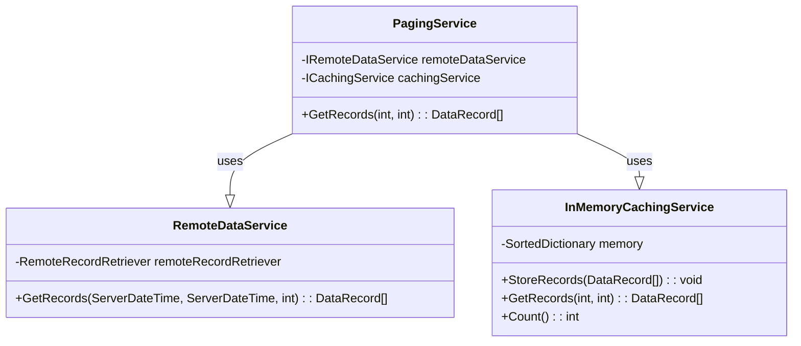

# RecordsFetcher

This application aims to provide efficient data retrieval from a remote server in a paginated manner. This is especially useful when handling large amounts of data. To minimize the load on the server, the application uses a caching service to store and serve data.

## Main Components

### PagingService

`PagingService` is the main service that interacts with the remote data service and the caching service. When a request for a specific page of data is received, it first checks the cache to see if the required data is already stored. If the data is not in the cache, the `PagingService` retrieves the necessary data from the remote service and stores it in the cache.

### RemoteDataService

`RemoteDataService` is responsible for retrieving data from the remote server. It uses the `RemoteRecordRetriever` to fetch records from the server based on the specified parameters: a start time, end time, and a limit to the number of records.

### InMemoryCachingService

`InMemoryCachingService` serves as an in-memory cache for the data retrieved from the remote service. It stores records in a sorted dictionary, which allows for efficient insertion and retrieval of records. The keys in the dictionary are the timestamp (ticks) of the record creation dates, ensuring that the data is sorted by the creation date.

## How It Works

1. A request is made to retrieve a certain page of data (with the page number and number of results per page specified).
2. `PagingService` calculates the start and end index of the required data based on the page number and results per page.
3. `PagingService` checks `InMemoryCachingService` if the required data is already cached.
4. If the required data is not cached:
    - `PagingService` requests data from the `RemoteDataService` in chunks (limited by a specified maximum number of records) until the cache contains enough data.
    - The requested data is stored in the `InMemoryCachingService`.
5. `PagingService` retrieves the required data from the `InMemoryCachingService` and returns it.

## Class Diagram

